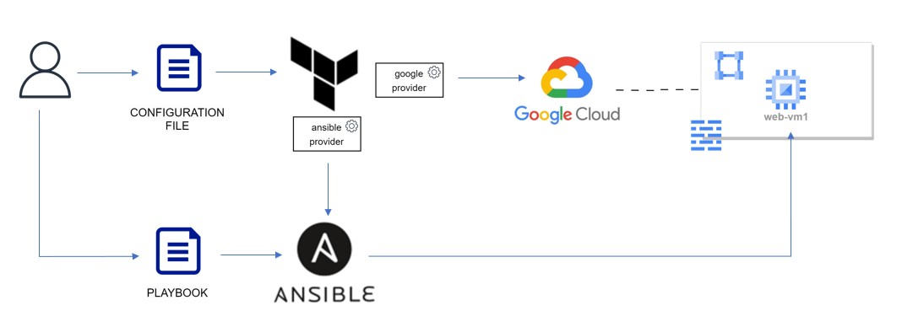

# Day 55 Bringing Together IaC and CM with Terraform Provider for Ansible

In this session we integrate Terraform and Ansible to provision and configure infrastructure dynamically. 

We provision infrastructure in Google Cloud with Terraform and configure a static web site on it with Ansible. To integrate the two tools we use Ansible Provider (https://registry.terraform.io/providers/ansible/ansible/latest/docs) and inventory plugin from Ansible Terraform collection - https://github.com/ansible-collections/cloud.terraform 

